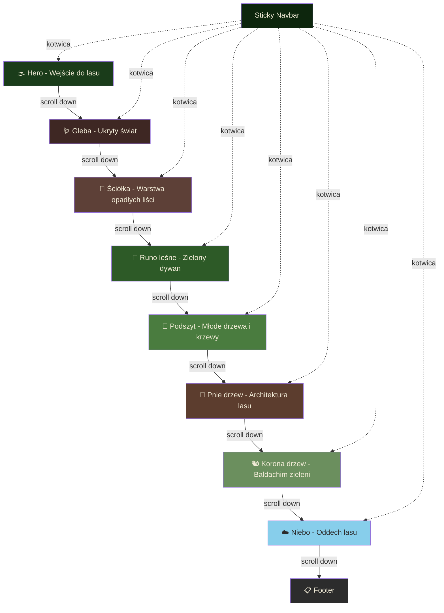
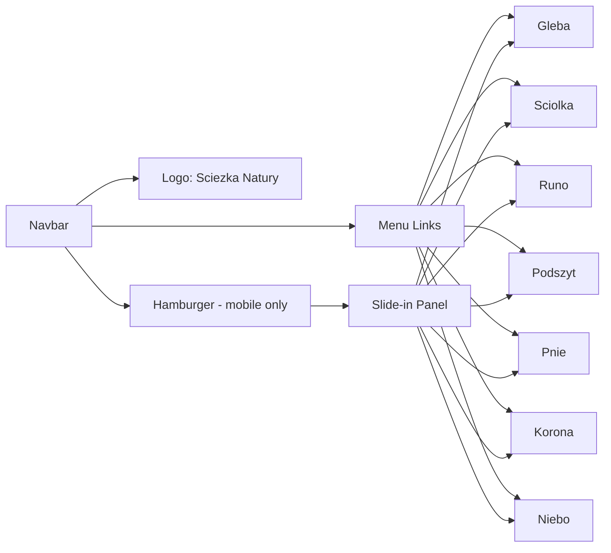

# 🌲 Ścieżka Natury — Dokumentacja Projektu

## Spis Treści

1. [Opis Projektu](#opis-projektu)
2. [Cel i Grupa Docelowa](#cel-i-grupa-docelowa)
3. [Stack Technologiczny](#stack-technologiczny)
4. [Struktura Plików](#struktura-plików)
5. [Architektura Strony](#architektura-strony)
6. [Sekcje Strony — Szczegółowe Opisy](#sekcje-strony)
7. [Nawigacja](#nawigacja)
8. [Efekty Wizualne i Techniczne](#efekty-wizualne-i-techniczne)
9. [Design System](#design-system)
10. [Responsywność](#responsywność)
11. [Accessibility](#accessibility)
12. [Performance](#performance)
13. [Zasoby i Źródła](#zasoby-i-źródła)
14. [Plan Implementacji](#plan-implementacji)
15. [Deploy i Hosting](#deploy-i-hosting)

---

## Opis Projektu

**Ścieżka Natury** to edukacyjna, jednostronicowa witryna internetowa z efektem parallax scrolling, która prowadzi użytkownika przez kolejne warstwy ekosystemu leśnego — od gleby pod stopami, przez ściółkę i runo leśne, podszyt i potężne pnie drzew, aż po korony drzew i otwarte niebo.

Strona łączy **edukację przyrodniczą** z **nowoczesnym web designem**, tworząc immersyjne doświadczenie scrollowania przez las od dołu do góry. Każda warstwa lasu stanowi osobną sekcję wizualną z unikalnymi treściami, animacjami i efektami parallax.

**Typ projektu:** Strona informacyjna / edukacyjna (one-page)
**Tematyka:** Rośliny, las, natura, ekosystem leśny
**Interaktywność:** Parallax scrolling, scroll-triggered animations, smooth navigation

---

## Cel i Grupa Docelowa

### Cele projektu
- Zaprezentowanie ekosystemu lasu w atrakcyjnej, interaktywnej formie
- Nauka frontendowych technologii (HTML/CSS/JS) poprzez praktyczny projekt
- Stworzenie efektownego elementu do portfolio webdevowego
- Edukacja przyrodnicza w przystępnej, wizualnej formie

### Grupa docelowa strony
- Uczniowie i studenci zainteresowani przyrodą
- Miłośnicy lasu i natury
- Osoby szukające edukacyjnych treści online
- Nauczyciele szukający materiałów dydaktycznych

### Grupa docelowa jako projekt portfolio
- Rekruterzy oceniający umiejętności frontendowe
- Inni developerzy szukający inspiracji

---

## Stack Technologiczny

| Technologia | Zastosowanie | Wersja |
|---|---|---|
| HTML5 | Struktura semantyczna | - |
| CSS3 | Stylowanie, animacje, parallax | - |
| Vanilla JavaScript | Interaktywność, Intersection Observer, scroll events | ES6+ |
| Google Fonts | Typografia | - |

### Dlaczego zero frameworków?
- **Prostota** — brak konfiguracji, bundlerów, node_modules
- **Nauka fundamentów** — zrozumienie czystego HTML/CSS/JS
- **Wydajność** — brak narzutu frameworka
- **Hosting** — dowolny statyczny hosting (zero kosztów)

### Wymagania systemowe do developmentu
- Dowolny edytor kodu (VS Code rekomendowany)
- Przeglądarka (Chrome/Firefox z DevTools)
- Opcjonalnie: Live Server extension w VS Code

---

## Struktura Plików

```
sciezka-natury/
│
├── index.html              # Główna i jedyna strona HTML
│
├── css/
│   ├── variables.css       # CSS Custom Properties (kolory, fonty, spacing)
│   ├── reset.css           # CSS Reset / Normalize
│   ├── style.css           # Główne style komponentów
│   ├── parallax.css        # Style efektów parallax i warstw
│   ├── animations.css      # Keyframes i klasy animacji
│   └── responsive.css      # Media queries i breakpointy
│
├── js/
│   ├── main.js             # Punkt wejścia — inicjalizacja wszystkich modułów
│   ├── parallax.js         # Logika parallax scrolling
│   ├── animations.js       # Intersection Observer — animacje przy scrollu
│   └── navbar.js           # Sticky navbar + aktywna sekcja + hamburger
│
├── img/
│   ├── hero/               # Zdjęcia do sekcji Hero
│   │   └── forest-mist.webp
│   ├── sections/           # Tła do poszczególnych sekcji
│   │   ├── soil-texture.webp
│   │   ├── litter-leaves.webp
│   │   ├── forest-floor.webp
│   │   ├── understory.webp
│   │   ├── tree-bark.webp
│   │   ├── canopy-light.webp
│   │   └── sky-clouds.webp
│   ├── content/            # Zdjęcia roślin i zwierząt do treści
│   │   ├── earthworm.webp
│   │   ├── mushroom.webp
│   │   ├── fern.webp
│   │   ├── moss.webp
│   │   ├── blueberry.webp
│   │   ├── hazel.webp
│   │   ├── oak-bark.webp
│   │   ├── pine-bark.webp
│   │   ├── squirrel.webp
│   │   └── woodpecker.webp
│   └── icons/              # Ikony SVG
│       ├── scroll-arrow.svg
│       ├── leaf.svg
│       ├── tree.svg
│       └── sun.svg
│
├── fonts/                  # Opcjonalne lokalne pliki fontów (jeśli nie Google CDN)
│
└── README.md               # Dokumentacja projektu dla GitHub
```

---

## Architektura Strony

### Diagram przepływu sekcji



### Semantyczna struktura HTML

```html
<body>
  <nav id="navbar">...</nav>

  <header id="hero" class="parallax-section">...</header>

  <main>
    <section id="gleba" class="parallax-section">...</section>
    <section id="sciolka" class="parallax-section">...</section>
    <section id="runo" class="parallax-section">...</section>
    <section id="podszyt" class="parallax-section">...</section>
    <section id="pnie" class="parallax-section">...</section>
    <section id="korona" class="parallax-section">...</section>
    <section id="niebo" class="parallax-section">...</section>
  </main>

  <footer id="footer">...</footer>
</body>
```

---

## Sekcje Strony

### Sekcja 0: 🌫️ Hero — Wejście do lasu

**Opis wizualny:**
Pełnoekranowe zdjęcie lasu spowitego mgłą. Tytuł animowany fade-in, podtytuł z opóźnieniem. Strzałka na dole pulsuje, zachęcając do scrollowania.

**Treści:**
- Tytuł: **"Ścieżka Natury"**
- Podtytuł: **"Odkryj tajemnice ekosystemu leśnego — warstwa po warstwie"**
- Mikro-tekst przy strzałce: "Przewiń w dół, aby wejść do lasu"

**Efekty:**
- Parallax: tło przesuwa się wolniej niż tekst
- Fade-in animacja tytułu (CSS `@keyframes`)
- Pulsująca strzałka (`animation: bounce`)
- Delikatny overlay gradient (ciemny na dole) dla lepszej czytelności tekstu

**Tło:** Zdjęcie mglistego lasu (Unsplash: "foggy forest")

---

### Sekcja 1: 🪱 Gleba — Ukryty świat pod stopami

**Opis wizualny:**
Ciemnobrązowe tło z teksturą ziemi. Elementy pojawiają się "wyrastając" z dołu. Ciepłe, ciemne tony.

**Treści edukacyjne:**
- **Nagłówek:** "Gleba — Fundament życia"
- **Opis główny:** Gleba leśna to żywy organizm. Składa się z minerałów, materii organicznej, wody i powietrza. W jednej garści leśnej gleby żyje więcej mikroorganizmów niż ludzi na Ziemi.
- **Kluczowe elementy:**
  - 🪱 **Dżdżownice** — inżynierowie gleby, przerabiają materię organiczną, napowietrzają glebę
  - 🍄 **Grzybnia (mycelium)** — podziemna sieć łącząca drzewa, tzw. "Wood Wide Web"
  - 🦠 **Mikroorganizmy** — bakterie i grzyby rozkładające materię organiczną
  - 💧 **Woda gruntowa** — gleba leśna działa jak gąbka, filtruje i magazynuje wodę

- **Ciekawostka (wyróżniony box):** "Drzewa wymieniają się składnikami odżywczymi przez sieć grzybni. Starsze drzewa potrafią 'karmić' młodsze sadzonki rosnące w cieniu — naukowcy nazywają to Matczynym Drzewem."

**Animacje:**
- Elementy slide-in-up (wyrastają z dołu ekranu)
- Ikony mikroorganizmów pojawiają się z fade-in

**Paleta sekcji:** `#3e2723` (ciemny brąz), `#5d4037` (brąz), `#8d6e63` (jasny brąz)

---

### Sekcja 2: 🍂 Ściółka — Warstwa opadłych liści

**Opis wizualny:**
Tło z teksturą opadłych liści, gałązek i szyszek. Ciepłe jesienne tony — pomarańcze, brązy, żółcie.

**Treści edukacyjne:**
- **Nagłówek:** "Ściółka — Recyclling natury"
- **Opis główny:** Ściółka to warstwa między żywymi roślinami a glebą mineralną. Składa się z opadłych liści, igieł, gałązek, kory, szyszek i obumarłych roślin. To naturalny kompostownik lasu.
- **Kluczowe elementy:**
  - 🍂 **Opadłe liście** — główny składnik ściółki w lasach liściastych, rozkładają się w ciągu 1-3 lat
  - 🌲 **Igły sosnowe** — rozkładają się wolniej (3-7 lat), zakwaszają glebę
  - 🐛 **Rozkładacze** — chrząszcze, stonogi, wazonkowce, roztocza przetwarzają materię
  - 🍄 **Grzyby saprofityczne** — maślaki, pieczarki leśne żywią się martwą materią

- **Ciekawostka:** "Las liściasty produkuje rocznie 3-5 ton ściółki na hektar. Bez rozkładaczy, po 50 latach liście zalegałyby na wysokość kilku metrów."

**Animacje:**
- Liście opadające z góry ekranu (CSS keyframes)
- Elementy pojawiające się fade-in z lekkim obrotem

**Paleta sekcji:** `#5d4037` (brąz), `#bf8040` (pomarańcz), `#8b6914` (złoty)

---

### Sekcja 3: 🌿 Runo leśne — Zielony dywan

**Opis wizualny:**
Soczyste zielenie. Zdjęcia paproci, mchów, borówek. Naturalny, świeży klimat.

**Treści edukacyjne:**
- **Nagłówek:** "Runo leśne — Zielony dywan lasu"
- **Opis główny:** Runo leśne to warstwa roślin zielnych, mchów i niskich krzewinek rosnących bezpośrednio na dnie lasu. Sięga do wysokości kolan. To najbogatsza warstwa pod względem różnorodności gatunkowej.
- **Kluczowe elementy (karty roślin z opisem):**
  - 🌿 **Paproć (Polypodiopsida)** — jedna z najstarszych roślin na Ziemi (ponad 360 mln lat), rozmnaża się przez zarodniki
  - 🟢 **Mech (Bryophyta)** — mchy nie mają korzeni, chłoną wodę całą powierzchnią, tworzą mikroekosystemy
  - 🫐 **Borówka czernica** — krzewinki do 50 cm, owoce bogate w antyoksydanty
  - 🌼 **Konwalia majowa** — piękna, ale silnie trująca (wszystkie części rośliny)
  - 🍀 **Szczawik zajęczy** — drobna roślinka z liśćmi jak koniczyna, zamyka liście na noc

- **Ciekawostka:** "Mchy potrafią wchłonąć wodę ważącą 20 razy więcej niż one same. Działają jak naturalna gąbka lasu."

**Animacje:**
- Karty roślin pojawiają się naprzemiennie z lewej i prawej (slide-in-left / slide-in-right)
- Delikatny efekt falowania na tle (CSS animation)

**Paleta sekcji:** `#2d5a27` (ciemna zieleń), `#4a7c3f` (zieleń), `#81c784` (jasna zieleń)

---

### Sekcja 4: 🌾 Podszyt — Młode drzewa i krzewy

**Opis wizualny:**
Warstwa gęstych krzewów i młodych drzewek. Zielono-brązowa kolorystyka. Poczucie głębi lasu.

**Treści edukacyjne:**
- **Nagłówek:** "Podszyt — Poczekalnia gigantów"
- **Opis główny:** Podszyt to warstwa krzewów i młodych drzew rosnących od poziomu kolan do kilku metrów wysokości. To "poczekalnia" — młode drzewa czekają tu na swoją szansę, aż stare drzewa upadną i otworzą lukę w baldachimie.
- **Kluczowe elementy:**
  - 🌳 **Leszczyna (Corylus avellana)** — krzew do 6m, producent orzechów laskowych, kluczowy dla wiewiórek
  - 🫐 **Kruszyna (Frangula alnus)** — jej owoce to pokarm dla ptaków, kora ma właściwości lecznicze
  - 🌹 **Dzika róża (Rosa canina)** — kolczaste krzewy z owocami bogatymi w witaminę C
  - 🌱 **Młode dęby i buki** — sadzonki czekające na "okno świetlne", mogą przetrwać w cieniu nawet 100 lat
  - 🦌 **Mieszkańcy podszytu** — sarny, zające, bażanty szukają tu schronienia

- **Ciekawostka:** "Młody buk może przetrwać w cieniu podszytu nawet 100 lat, rosnąc zaledwie kilka centymetrów rocznie. Gdy stare drzewo padnie, nagle przyśpiesza wzrost 10-krotnie."

**Animacje:**
- Krzewy "wyrastają" od dołu (scale-up + fade-in)
- Parallax z wieloma warstwami liści

**Paleta sekcji:** `#4a7c3f` (zieleń), `#6b8f5e` (jasna zieleń), `#3e6b35` (ciemna zieleń)

---

### Sekcja 5: 🌳 Pnie drzew — Architektura lasu

**Opis wizualny:**
Tekstura kory drzewnej. Ciepłe brązy. Infografika przekroju pnia. Monumentalne, wertykalne linie.

**Treści edukacyjne:**
- **Nagłówek:** "Pnie drzew — Kolumny katedry natury"
- **Opis główny:** Pnie drzew to szkielet lasu. Transportują wodę z korzeni do liści na wysokość nawet 100 metrów, wbrew grawitacji. Każdy pień to archiwum — jego słoje opowiadają historię setek lat.
- **Kluczowe elementy (rozpoznawanie drzew po korze):**
  - 🟤 **Dąb szypułkowy** — głęboko spękana, gruba kora, żyje do 1000 lat
  - ⚪ **Brzoza brodawkowata** — biała, papierowa kora łuszcząca się pasami
  - 🟠 **Sosna zwyczajna** — ceglastoczerwona kora w górnej części pnia
  - 🔘 **Buk zwyczajny** — gładka, szara kora przypominająca skórę słonia

- **Infografika — Przekrój pnia:**
  - **Kora** — zewnętrzna warstwa ochronna
  - **Łyko** — transportuje cukry z liści do korzeni
  - **Kambium** — cienka warstwa, w której drzewo rośnie na grubość
  - **Drewno bielaste** — transportuje wodę z korzeni do liści
  - **Twardziel** — martwe drewno, stabilizacja mechaniczna
  - **Rdzeń** — najstarsze centrum pnia

- **Ciekawostka:** "Drzewo nie ma pompy — woda podróżuje w górę dzięki transpiracji z liści, siłom kapilarnym i kohezji cząsteczek wody. Duży dąb transportuje nawet 400 litrów wody dziennie."

**Animacje:**
- Infografika przekroju "rysuje się" warstwa po warstwie przy scrollu
- Elementy rozpoznawcze kory pojawiają się z fade-in

**Paleta sekcji:** `#5c3d2e` (kora), `#795548` (jasny brąz), `#4e342e` (ciemny brąz)

---

### Sekcja 6: 🐿️ Korona drzew — Baldachim zieleni

**Opis wizualny:**
Jasne zielenie, prześwity słońca przez liście. Efekt patrzenia w górę. Lekki, lotny klimat.

**Treści edukacyjne:**
- **Nagłówek:** "Korona drzew — Fabryka życia"
- **Opis główny:** Korony drzew tworzą baldachim — zielony dach lasu. To tutaj zachodzi fotosynteza, tu żyją ptaki i owady, tu drzewa walczą o każdy promień słońca. Korony dojrzałego lasu mogą pokrywać nawet 95% powierzchni nieba.
- **Kluczowe elementy:**
  - 🌞 **Fotosynteza** — liście zamieniają CO2 i wodę w cukier i tlen; jedno duże drzewo produkuje tlen dla 4 osób rocznie
  - 🐿️ **Wiewiórka (Sciurus vulgaris)** — mistrzyni akrobacji, robi zapasy na zimę zakopując żołędzie (i zapominając gdzie — tak sadzi nowe dęby)
  - 🐦 **Dzięcioł (Dendrocopos)** — "lekarz lasu", szuka owadów w korze; jego dziuple zasiedlają potem inne zwierzęta
  - 🦋 **Owady** — korona to siedlisko milionów gatunków; same mrówki mogą stanowić 10% biomasy lasu
  - 🌬️ **Efekt baldachimu** — korony moderują temperaturę (las jest 5-10 stopni chłodniejszy niż otwarta przestrzeń)

- **Ciekawostka:** "Korony sąsiednich drzew często nie dotykają się nawzajem, tworząc tzw. 'crown shyness' — tajemnicze szczeliny między koronami. Naukowcy wciąż debatują, dlaczego tak się dzieje."

**Animacje:**
- Liście "spadające" z różnymi prędkościami (parallax warstwy)
- Promienie słońca pulsujące lekko (CSS animation)
- Ikony zwierząt z tooltipami (hover effect)

**Paleta sekcji:** `#6b8f5e` (mech), `#a5d6a7` (jasna zieleń), `#fff9c4` (słoneczny żółty)

---

### Sekcja 7: ☁️ Niebo — Oddech lasu

**Opis wizualny:**
Gradient od zieleni do błękitu nieba. Chmury przesuwają się powoli. Otwarta, spokojna przestrzeń. Ton podsumowujący.

**Treści edukacyjne:**
- **Nagłówek:** "Niebo — Las oddycha dla nas"
- **Opis główny:** Lasy to płuca planety. Pochłaniają CO2 i produkują tlen, regulują klimat, zatrzymują wodę, chronią glebę przed erozją. Polskie lasy pokrywają 29.6% powierzchni kraju — ale wciąż za mało.
- **Statystyki (duże, animowane liczniki):**
  - 🌍 **29.6%** — powierzchnia Polski pokryta lasami
  - 🌲 **1 hektar lasu** pochłania rocznie 5-10 ton CO2
  - 💨 **1 duże drzewo** produkuje tlen dla 4 osób
  - 💧 **Las** zatrzymuje do 200 mm wody na metr kwadratowy
  - 🌡️ **-10°C** — o tyle cooler może być w lesie niż w mieście latem

- **Sekcja "Chroń las":**
  - Krótki apel o ochronę lasów
  - Linki do organizacji: Lasy Państwowe, WWF Polska, Klub Gaja
  - Przycisk "Posadź drzewo" (link do akcji sadzenia)

- **Ciekawostka:** "Gdyby lasy amazońskie zniknęły, roczne opady w całej Ameryce Południowej spadłyby o 25%. Lasy nie tylko produkują tlen — one dosłownie tworzą deszcz."

**Animacje:**
- Chmury przesuwające się powoli (CSS translateX animation)
- Liczniki animowane (CountUp effect w JS — od 0 do wartości docelowej)
- Fade-in elementów przy scrollu

**Paleta sekcji:** `#87ceeb` (niebo), `#b3e5fc` (jasne niebo), `#ffffff` (chmury)

---

### Sekcja 8: 📋 Footer

**Zawartość:**
- Szybka nawigacja do wszystkich sekcji
- Informacja o autorze i celu projektu
- Źródła danych naukowych
- Licencje zdjęć (Unsplash/Pexels — free license)
- Link do repozytorium GitHub

**Styl:** Ciemne tło (`#1a1a2e`), jasny tekst, minimalistyczny layout

---

## Nawigacja

### Desktop
- **Sticky navbar** przyklejony do górnej krawędzi ekranu
- W Hero: przezroczyste tło, biały tekst
- Po scrollu > 100px: pełne ciemne tło z blur (`backdrop-filter: blur`)
- Linki do 7 sekcji tematycznych (gleba → niebo)
- Aktywna sekcja podświetlona (Intersection Observer API)
- Logo/nazwa "Ścieżka Natury" po lewej
- Smooth scrolling (`scroll-behavior: smooth` + JS fallback)

### Mobile
- Hamburger menu (3 kreski → X)
- Wysuwany panel z linkami (slide-in z prawej)
- Po kliknięciu linku panel się zamyka
- Touch-friendly targets (min 44x44px)

### Diagram nawigacji



---

## Efekty Wizualne i Techniczne

### Parallax Scrolling

**Metoda podstawowa — CSS:**
```css
.parallax-section {
    background-attachment: fixed;
    background-position: center;
    background-size: cover;
}
```

**Metoda zaawansowana — JS (multi-layer):**
```javascript
window.addEventListener('scroll', () => {
    const scrolled = window.pageYOffset;
    layers.forEach(layer => {
        const speed = layer.dataset.speed;
        layer.style.transform = `translateY(${scrolled * speed}px)`;
    });
});
```

**Uwagi:**
- Na iOS/Safari `background-attachment: fixed` nie działa — zastosować fallback
- Na mobile całkowicie wyłączyć parallax JS dla wydajności
- Użyć `will-change: transform` dla warstw parallax (GPU acceleration)

### Scroll-Triggered Animations

**Technologia:** Intersection Observer API

```javascript
const observer = new IntersectionObserver((entries) => {
    entries.forEach(entry => {
        if (entry.isIntersecting) {
            entry.target.classList.add('visible');
        }
    });
}, { threshold: 0.1 });

document.querySelectorAll('.animate-on-scroll').forEach(el => {
    observer.observe(el);
});
```

**Typy animacji CSS:**

| Klasa | Efekt | Użycie |
|---|---|---|
| `.fade-in` | Opacity 0 → 1 | Wszystkie elementy |
| `.slide-in-left` | Przesunięcie z lewej | Parzyste karty |
| `.slide-in-right` | Przesunięcie z prawej | Nieparzyste karty |
| `.slide-in-up` | Przesunięcie z dołu | Elementy gleby |
| `.scale-up` | Powiększenie 0.8 → 1 | Ikony, statystyki |
| `.draw-in` | Rysowanie SVG | Infografika przekroju |

### Animated Counters (Sekcja Niebo)

```javascript
function animateCounter(element, target, duration) {
    let start = 0;
    const increment = target / (duration / 16);
    const timer = setInterval(() => {
        start += increment;
        if (start >= target) {
            element.textContent = target;
            clearInterval(timer);
        } else {
            element.textContent = Math.floor(start);
        }
    }, 16);
}
```

---

## Design System

### Paleta Kolorów

```css
:root {
    /* Główne kolory lasu */
    --forest-darkest:   #0d260d;    /* Najciemniejsza zieleń - navbar */
    --forest-dark:      #1a3c1a;    /* Ciemna zieleń - hero */
    --forest-green:     #2d5a27;    /* Zieleń drzew */
    --leaf-green:       #4a7c3f;    /* Liście */
    --moss-green:       #6b8f5e;    /* Mech */
    --light-green:      #a5d6a7;    /* Jasna zieleń */

    /* Brązy i gleba */
    --soil-dark:        #3e2723;    /* Ciemna gleba */
    --soil-brown:       #5d4037;    /* Brąz gleby */
    --bark-brown:       #5c3d2e;    /* Kora */
    --bark-light:       #795548;    /* Jasna kora */
    --litter-orange:    #bf8040;    /* Ściółka */
    --litter-gold:      #8b6914;    /* Złoty liść */

    /* Niebo */
    --sky-blue:         #87ceeb;    /* Niebo */
    --sky-light:        #b3e5fc;    /* Jasne niebo */
    --cloud-white:      #f5f5f0;    /* Chmury */
    --sun-gold:         #d4a843;    /* Słońce */
    --sun-yellow:       #fff9c4;    /* Jasne promienie */

    /* Tekst */
    --text-on-dark:     #f0ead6;    /* Kremowy tekst na ciemnym tle */
    --text-on-light:    #2c2c2c;    /* Ciemny tekst na jasnym tle */

    /* Footer */
    --footer-bg:        #1a1a2e;    /* Ciemny granat */
}
```

### Typografia

```css
:root {
    /* Fonty */
    --font-heading: 'Playfair Display', Georgia, serif;
    --font-body: 'Lato', 'Segoe UI', sans-serif;

    /* Rozmiary (fluid - clamp) */
    --text-xs:    clamp(0.75rem, 0.7rem + 0.25vw, 0.875rem);
    --text-sm:    clamp(0.875rem, 0.8rem + 0.375vw, 1rem);
    --text-base:  clamp(1rem, 0.9rem + 0.5vw, 1.125rem);
    --text-lg:    clamp(1.125rem, 1rem + 0.625vw, 1.375rem);
    --text-xl:    clamp(1.5rem, 1.2rem + 1.5vw, 2rem);
    --text-2xl:   clamp(2rem, 1.5rem + 2.5vw, 3rem);
    --text-3xl:   clamp(2.5rem, 2rem + 3vw, 4rem);
    --text-hero:  clamp(3rem, 2rem + 5vw, 6rem);

    /* Line heights */
    --leading-tight: 1.2;
    --leading-normal: 1.6;
    --leading-relaxed: 1.8;
}
```

### Spacing

```css
:root {
    --space-xs:   0.5rem;
    --space-sm:   1rem;
    --space-md:   2rem;
    --space-lg:   4rem;
    --space-xl:   6rem;
    --space-2xl:  8rem;

    --section-padding: clamp(4rem, 8vw, 10rem) clamp(1rem, 5vw, 4rem);
}
```

---

## Responsywność

### Breakpointy

| Breakpoint | Zakres | Urządzenie |
|---|---|---|
| xs | 0 - 479px | Telefony (portrait) |
| sm | 480 - 767px | Telefony (landscape), małe tablety |
| md | 768 - 1023px | Tablety |
| lg | 1024 - 1199px | Laptopy |
| xl | 1200px+ | Desktopy |

### Zmiany na mobile (< 768px)
- Parallax wyłączony (`background-attachment: scroll`)
- Parallax JS wyłączony (media query check)
- Single-column layout
- Hamburger menu zamiast inline nawigacji
- Mniejsze fonty (fluid typography)
- Uproszczone animacje (tylko fade-in)
- Infografika przekroju pnia: wersja uproszczona

---

## Accessibility

- **Semantyczny HTML** — poprawne użycie `header`, `main`, `section`, `footer`, `nav`
- **Alt texty** — opisowe alt dla wszystkich zdjęć
- **Contrast ratio** — minimum 4.5:1 (WCAG AA) dla tekstu
- **Focus styles** — widoczne outline dla nawigacji klawiaturą
- **`prefers-reduced-motion`** — wyłączenie animacji dla użytkowników z epilepsją

```css
@media (prefers-reduced-motion: reduce) {
    *, *::before, *::after {
        animation-duration: 0.01ms !important;
        transition-duration: 0.01ms !important;
    }
}
```

- **Skip to content link** — ukryty link na górze strony
- **ARIA labels** — dla hamburger menu i interaktywnych elementów

---

## Performance

- **Obrazy WebP** — 30-50% mniejsze niż JPEG
- **Lazy loading** — `loading="lazy"` na zdjęciach poniżej fold
- **Optymalne rozmiary** — max 1920px szerokość, kompresja do < 200KB per obraz
- **CSS / JS nie blokujące** — CSS w `<head>`, JS z `defer`
- **Brak zewnętrznych bibliotek** — zero dodatkowych HTTP requests (poza Google Fonts)
- **Font display swap** — `font-display: swap` w Google Fonts URL

```html
<link href="https://fonts.googleapis.com/css2?family=Playfair+Display:wght@400;700&family=Lato:wght@300;400;700&display=swap" rel="stylesheet">
```

- **Target:** Lighthouse score > 90 na wszystkich kategoriach

---

## Zasoby i Źródła

### Darmowe zdjęcia

| Sekcja | Sugerowane wyszukiwanie | Źródło |
|---|---|---|
| Hero | "foggy forest path" | Unsplash |
| Gleba | "forest soil texture", "earthworm macro" | Pexels |
| Ściółka | "fallen leaves forest floor" | Pixabay |
| Runo leśne | "fern forest", "moss close up", "blueberry bush" | Unsplash |
| Podszyt | "forest understory", "hazel bush" | Pexels |
| Pnie drzew | "tree bark texture", "oak trunk", "birch bark" | Unsplash |
| Korona | "forest canopy sunlight", "looking up trees" | Unsplash |
| Niebo | "sky through trees", "clouds blue sky" | Pexels |

### Źródła treści edukacyjnych
- Lasy Państwowe (lasy.gov.pl) — dane o polskich lasach
- Wikipedia — informacje o gatunkach
- National Geographic — ciekawostki
- Książka "Sekretne życie drzew" — Peter Wohlleben

### Narzędzia
- **VS Code** + Live Server extension
- **Chrome DevTools** — debugging, responsive testing
- **Lighthouse** — audyt performance
- **TinyPNG / Squoosh** — kompresja obrazów
- **Figma** (opcjonalnie) — mockupy

---

## Plan Implementacji

### Krok 1: Fundament
- [ ] Utworzyć strukturę plików i folderów
- [ ] Napisać szkielet HTML (semantyczne sekcje)
- [ ] Dodać CSS reset i zmienne (variables.css)
- [ ] Podłączyć Google Fonts

### Krok 2: Base Styling
- [ ] Ostylować sekcję Hero (pełny ekran, tło, tytuł)
- [ ] Ostylować każdą z 7 sekcji tematycznych (tła, kolory, spacing)
- [ ] Dodać typografię i spacing globalny
- [ ] Dodać footer

### Krok 3: Nawigacja
- [ ] Zbudować sticky navbar (HTML + CSS)
- [ ] Dodać smooth scrolling do kotwic
- [ ] Zaimplementować zmianę tła navbar przy scrollu (JS)
- [ ] Dodać podświetlanie aktywnej sekcji (Intersection Observer)

### Krok 4: Treści
- [ ] Napisać treści edukacyjne dla każdej sekcji
- [ ] Pobrać i zoptymalizować zdjęcia (WebP, lazy loading)
- [ ] Dodać karty roślin/zwierząt z opisami
- [ ] Stworzyć infografikę przekroju pnia (HTML/CSS lub SVG)

### Krok 5: Animacje i Parallax
- [ ] Zaimplementować parallax CSS (background-attachment)
- [ ] Dodać Intersection Observer dla scroll animations
- [ ] Dodać klasy animacji CSS (fade-in, slide-in, scale-up)
- [ ] Zaimplementować animated counters (sekcja Niebo)

### Krok 6: Responsywność
- [ ] Media queries — mobile first
- [ ] Hamburger menu na mobile
- [ ] Wyłączenie parallax na mobile
- [ ] Test na różnych rozdzielczościach (Chrome DevTools)

### Krok 7: Polish i Deploy
- [ ] Accessibility audit (contrast, alt texts, focus styles)
- [ ] Performance audit (Lighthouse)
- [ ] Reduced motion support
- [ ] Deploy na GitHub Pages lub Netlify
- [ ] Napisać README.md dla repozytorium

---

## Deploy i Hosting

### GitHub Pages (rekomendowane)
1. Utworzyć repozytorium na GitHub
2. Push kodu
3. Settings → Pages → Source: main branch, / (root)
4. Strona dostępna pod: `https://username.github.io/sciezka-natury`

### Netlify (alternatywa)
1. Konto na netlify.com
2. Drag & drop folderu projektu
3. Automatyczny deploy z custom URL

**Koszt:** 0 zł (oba rozwiązania darmowe dla statycznych stron)
