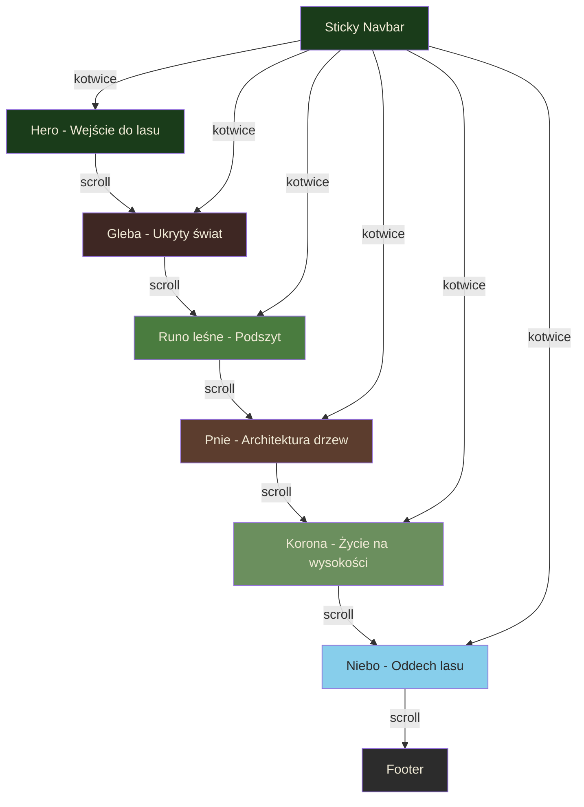
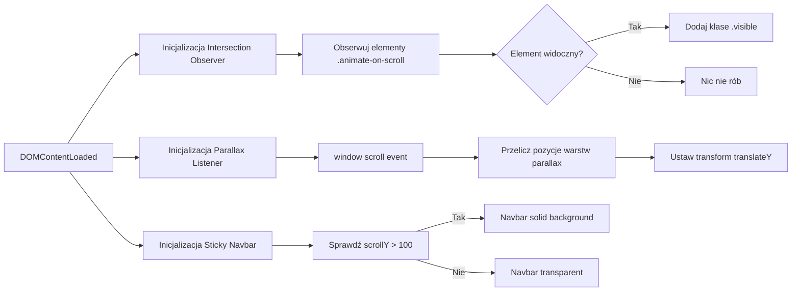

# 🌲 Ścieżka Natury — Plan Implementacji

## Opis Projektu

**Ścieżka Natury** to jednostronicowa witryna z efektem parallax scrolling, która opowiada historię ekosystemu leśnego — od warstwy gleby, przez korzenie i podszyt, aż po korony drzew i niebo. Każda sekcja zawiera edukacyjne treści o danym poziomie lasu, animacje pojawiania się elementów i atmosferyczny design.

**Stack:** Vanilla HTML + CSS + JavaScript (zero frameworków, zero zależności)
**Hosting:** GitHub Pages lub Netlify (darmowy)
**Budżet:** 0 zł (darmowe zdjęcia z Unsplash/Pexels/Pixabay)

---

## Struktura Plików

```
sciezka-natury/
├── index.html          # Główna strona
├── css/
│   ├── style.css       # Główne style
│   ├── parallax.css    # Style parallax i animacji
│   └── responsive.css  # Media queries
├── js/
│   ├── main.js         # Logika główna
│   ├── parallax.js     # Efekty parallax przy scrollu
│   └── animations.js   # Animacje pojawiania się elementów
├── img/
│   ├── hero/           # Zdjęcia do sekcji hero
│   ├── sections/       # Tła sekcji (gleba, korzenie, pień, korona, niebo)
│   └── icons/          # Ikony roślin i zwierząt (SVG)
├── fonts/              # Opcjonalne lokalne fonty
└── README.md           # Dokumentacja projektu
```

---

## Sekcje Strony (od góry do dołu)

### 0. 🌫️ Hero — Wejście do lasu
- Pełnoekranowe zdjęcie lasu z mgłą
- Tytuł: "Ścieżka Natury" z animacją fade-in
- Podtytuł: "Odkryj tajemnice ekosystemu leśnego — warstwa po warstwie"
- Strzałka zachęcająca do scrollowania w dół (pulsująca animacja)
- Efekt parallax na tle (wolniejsze przesuwanie tła)

### 1. 🪱 Gleba — Ukryty świat pod stopami
- Tło: ciemnobrązowe, tekstura ziemi
- Treść: Mikroorganizmy, grzybnia (Wood Wide Web), dżdżownice, woda gruntowa
- Animacja: elementy "wyrastają" z dołu przy scrollowaniu
- Ciekawostka: sieć grzybni łącząca drzewa — "Matczyne Drzewo"

### 2. 🍂 Ściółka — Recycling natury
- Tło: tekstura opadłych liści, jesienne tony (pomarańcze, brązy, złota)
- Treść: Opadłe liście, igły sosnowe, rozkładacze, grzyby saprofityczne
- Animacja: liście opadające z góry (CSS keyframes)
- Ciekawostka: "Las produkuje 3-5 ton ściółki na hektar rocznie"

### 3. 🌿 Runo leśne — Zielony dywan
- Tło: soczyste zielenie, gradient zielono-brązowy
- Treść: Paprocie, mchy, borówki, konwalie, szczawik zajęczy
- Elementy: karty roślin z opisem (5 roślin)
- Animacja: karty pojawiają się z lewej/prawej na przemian (slide-in)
- Parallax: wielowarstwowe nakładki z roślinami

### 4. 🌾 Podszyt — Poczekalnia gigantów
- Tło: gęste krzewy, zielono-brązowa kolorystyka
- Treść: Leszczyna, kruszyna, dzika róża, młode dęby i buki, mieszkańcy podszytu
- Animacja: krzewy "wyrastają" od dołu (scale-up + fade-in)
- Ciekawostka: "Młody buk może przetrwać w cieniu 100 lat"

### 5. 🌳 Pnie drzew — Kolumny katedry natury
- Tło: tekstura kory drzewa, ciepłe brązy
- Treść: Rozpoznawanie drzew po korze (dąb, brzoza, sosna, buk)
- Elementy: infografika przekroju pnia (kora, łyko, kambium, biel, twardziel, rdzeń)
- Animacja: przekrój pnia "rysuje się" warstwa po warstwie
- Ciekawostka: "Duży dąb transportuje nawet 400 litrów wody dziennie"

### 6. 🐿️ Korona drzew — Baldachim zieleni
- Tło: jasne zielenie, prześwity słońca przez liście
- Treść: Fotosynteza, wiewiórki, dzięcioły, owady, efekt baldachimu
- Elementy: ikony zwierząt z tooltipami
- Animacja: liście "spadające" z parallax efektem, promienie słońca pulsujące
- Ciekawostka: "Crown shyness — korony sąsiednich drzew nie dotykają się"

### 7. ☁️ Niebo — Oddech lasu
- Tło: gradient od zieleni do błękitu nieba
- Treść: Rola lasu w produkcji tlenu, statystyki, ochrona lasów
- Elementy: animowane liczniki statystyk (CountUp effect)
- Animacja: chmury przesuwają się powoli
- Call-to-action: "Chroń lasy — posadź drzewo" z linkami do fundacji

### 8. 📋 Footer
- Nawigacja do poszczególnych sekcji
- Źródła zdjęć i danych naukowych
- Informacja o autorze
- Link do repozytorium GitHub

---

## Nawigacja

- **Sticky navbar** z przezroczystym tłem (zmienia się na pełne przy scrollu)
- Linki-kotwice do każdej sekcji z **smooth scrolling**
- Aktywna sekcja podświetlona w navbarze (Intersection Observer API)
- Na mobile: hamburger menu

---

## Efekty Techniczne

### Parallax Scrolling
- Realizacja: CSS `background-attachment: fixed` dla prostych efektów + JS `window.addEventListener scroll` dla zaawansowanych warstw
- Różne prędkości przesuwania dla tła, środkowej warstwy i pierwszego planu
- Fallback na mobilnych (parallax wyłączony — problemy z wydajnością na iOS)

### Animacje Scroll-Triggered
- **Intersection Observer API** — wydajniejsze niż nasłuchiwanie scroll events
- Klasy CSS: `.hidden` (domyślna) → `.visible` (dodawana przez JS)
- Typy animacji: fade-in, slide-in-left, slide-in-right, scale-up
- CSS: `transition` + `transform` + `opacity`

### Responsywność
- Mobile-first approach
- Breakpointy: 480px, 768px, 1024px, 1200px
- Na mobile: brak parallax, uproszczone animacje, single-column layout
- Testowanie na Chrome DevTools

---

## Paleta Kolorów

```
--forest-dark:    #1a3c1a    /* Ciemna zieleń lasu */
--forest-green:   #2d5a27    /* Zieleń drzew */
--leaf-green:     #4a7c3f    /* Liście */
--moss:           #6b8f5e    /* Mech */
--bark-brown:     #5c3d2e    /* Kora */
--soil-brown:     #3e2723    /* Gleba */
--sky-blue:       #87ceeb    /* Niebo */
--cloud-white:    #f5f5f0    /* Chmury */
--gold-sun:       #d4a843    /* Przebłyski słońca */
--text-light:     #f0ead6    /* Tekst na ciemnym tle */
--text-dark:      #2c2c2c    /* Tekst na jasnym tle */
```

---

## Typografia

- **Heading font:** Google Fonts — "Playfair Display" (serif, elegancki, naturalny klimat)
- **Body font:** Google Fonts — "Lato" lub "Source Sans Pro" (sans-serif, czytelny)
- Rozmiary: fluid typography z `clamp()` dla responsywności

---

## Źródła Zasobów (Darmowe)

| Zasób | Źródło |
|---|---|
| Zdjęcia | Unsplash, Pexels, Pixabay (darmowe, bez licencji) |
| Ikony SVG | Heroicons, Lucide Icons, lub ręcznie rysowane |
| Fonty | Google Fonts (bezpłatne) |
| Inspiracje CSS | CodePen parallax examples |

---

## Diagram Architektury Strony



---

## Diagram Techniczny — Przepływ JS



---

## Kolejność Implementacji (Plan Zadań)

1. **Szkielet HTML** — Semantyczna struktura z sekcjami (header, main z sections, footer)
2. **Base CSS** — Reset, zmienne CSS, typografia, paleta kolorów
3. **Layout sekcji** — Stylowanie każdej sekcji osobno (tła, kolory, spacing)
4. **Nawigacja sticky** — Przezroczysty navbar z przejściem do pełnego tła
5. **Parallax CSS** — `background-attachment: fixed` dla tła sekcji
6. **Parallax JS** — Zaawansowane wielowarstwowe efekty (opcjonalne)
7. **Scroll animations** — Intersection Observer + CSS transitions
8. **Responsywność** — Media queries, hamburger menu, wyłączenie parallax na mobile
9. **Treści i zdjęcia** — Pobranie zdjęć z darmowych źródeł, napisanie tekstów
10. **Polishing** — Smooth scroll, loading performance, drobne poprawki
11. **Deploy** — GitHub Pages lub Netlify

---

## Uwagi Końcowe

- **Brak frameworków** — wszystko czyste HTML/CSS/JS, idealne do nauki
- **Progressive Enhancement** — strona działa bez JS (tylko bez animacji)
- **Performance** — zdjęcia w formatach WebP, lazy loading z `loading="lazy"`
- **Accessibility** — semantyczny HTML, alt texty, contrast ratio > 4.5:1
