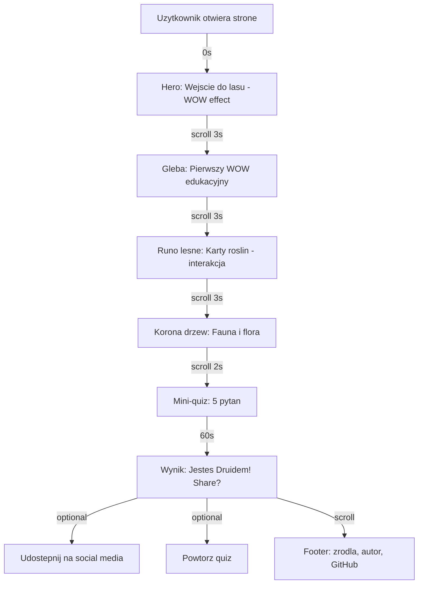
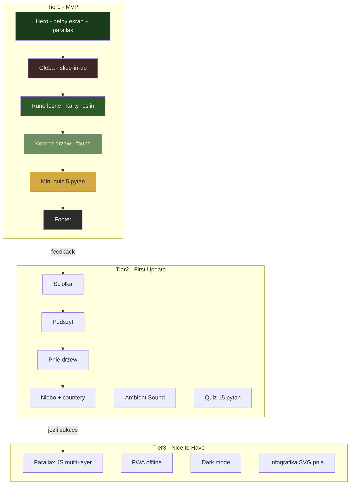

# WF_MVP_Scoping dla Ścieżka Natury

## Kontekst

**Pomysł:** Ścieżka Natury — edukacyjna strona z parallax scrolling o 7 warstwach ekosystemu leśnego.
**Wynik WF_Kill_The_Idea:** PIVOT — dodać element interaktywny (quiz/dźwięki).
**Wynik WF_ICE_Ranking:** ICE 18.0 (Low) — w obecnej formie. Z pivotem quiz → potencjalnie ~35-40 (Medium).
**Stack:** Vanilla HTML/CSS/JS.
**Developer:** Początkujący, 5-10h/tydzień.
**Budżet:** 0 zł.

---

## 🎯 MVP Scope: Ścieżka Natury

### Target Metrics (Co chcesz walidować?)
- [ ] Czy strona utrzymuje użytkownika dłużej niż 2 minuty (średni czas sesji)?
- [ ] Czy użytkownik scrolluje do końca strony (>80% depth)?
- [ ] Czy użytkownik kończy quiz na końcu strony?
- [ ] Czy strona jest udostępniana na social media (min. 5 share'ów w pierwszym tygodniu)?
- [ ] Czy rekruterzy komentują stronę pozytywnie w portfolio (min. 1 feedback)?

### Fundamentalna Zasada MVP

> **MVP tej strony to NIE "wszystkie 7 sekcji z pełnym parallax i animacjami". To 3-4 sekcje z działającym parallax, 1 quizem i responsywnym designem. Reszta to Post-MVP.**

---

## Faza Audytu Funkcji

### Przefiltrowywanie przez 4 pytania

| Funkcja | P1: Niezbędna do wartości? | P2: < 4h? | P3: Tracimy użytkownika bez niej? | P4: Walidacja bez budowy? | Tier |
|---|---|---|---|---|---|
| Hero sekcja (pełny ekran + tytuł) | TAK | TAK (2h) | TAK | NIE | **Tier 1** |
| Sekcja Gleba | TAK (pierwsza warstwa) | TAK (3h) | TAK (wejście w temat) | NIE | **Tier 1** |
| Sekcja Runo leśne | TAK (karty roślin) | TAK (3h) | NIE | NIE | **Tier 1** |
| Sekcja Korona drzew | TAK (widowiskowa) | TAK (3h) | NIE | NIE | **Tier 1** |
| Sekcja Ściółka | NIE (uzupełnienie) | TAK (3h) | NIE | TAK (tekst) | **Tier 2** |
| Sekcja Podszyt | NIE (uzupełnienie) | TAK (3h) | NIE | TAK (tekst) | **Tier 2** |
| Sekcja Pnie drzew | NIE (infografika jest trudna) | NIE (6h+) | NIE | TAK | **Tier 2** |
| Sekcja Niebo + statystyki | Częściowo (CTA) | NIE (5h z counterami) | NIE | TAK | **Tier 2** |
| Mini-quiz (5 pytań) | TAK (pivot!) | TAK (4h) | TAK (angażowalność) | NIE | **Tier 1** |
| Parallax CSS (background-attachment) | TAK (core doświadczenie) | TAK (1h) | TAK | NIE | **Tier 1** |
| Parallax JS (multi-layer) | NIE (CSS wystarczy) | NIE (6h+) | NIE | NIE | **Tier 3** |
| Scroll animations (Intersection Observer) | TAK | TAK (2h) | Częściowo | NIE | **Tier 1** |
| Sticky navbar | TAK | TAK (2h) | TAK (nawigacja) | NIE | **Tier 1** |
| Hamburger menu (mobile) | TAK | TAK (2h) | TAK (mobile) | NIE | **Tier 1** |
| Smooth scrolling | TAK | TAK (0.5h) | NIE | NIE | **Tier 1** |
| Animated counters | NIE | TAK (2h) | NIE | TAK | **Tier 2** |
| Ambient sound | NIE (Pivot 3) | TAK (3h) | NIE | NIE | **Tier 2** |
| Infografika przekroju pnia | NIE | NIE (8h+) | NIE | NIE | **Tier 3** |
| PWA / Offline mode | NIE | NIE (20h+) | NIE | NIE | **Tier 3** |
| Dark mode | NIE | Częściowo (3h) | NIE | NIE | **Tier 3** |

---

## Struktura MVP — Tiery

### Tier 1: Must-Have (Cel: 2-3 tygodnie przy 5-10h/tydzień)

Minimum do publicznego wrzucenia na GitHub Pages i pochwalenia się na LinkedIn.

| # | Funkcja | Czas est. | Szczegóły |
|---|---------|-----------|-----------|
| 1 | **Szkielet HTML** — semantyczna struktura | 2h | header, nav, main z 4 sections, footer |
| 2 | **CSS Base** — reset, zmienne, typografia | 2h | variables.css, Google Fonts, kolory |
| 3 | **Hero sekcja** — pełny ekran, tytuł, strzałka | 3h | Zdjęcie z Unsplash, fade-in tytuł, bounce strzałka |
| 4 | **Sekcja Gleba** — treść + animacja | 3h | Ciemne tło, tekst, slide-in-up elementy |
| 5 | **Sekcja Runo leśne** — karty roślin | 4h | 4-5 kart z CSS Grid, opisy, zdjęcia |
| 6 | **Sekcja Korona drzew** — fauna + flora | 3h | Jasne tło, ikony zwierząt, treści |
| 7 | **Footer** — nawigacja, źródła | 1h | Linki, licencje, autor |
| 8 | **Parallax CSS** — background-attachment: fixed | 1h | Na 4 sekcjach, fallback na mobile |
| 9 | **Scroll animations** — Intersection Observer | 3h | .fade-in, .slide-in-left, .slide-in-right |
| 10 | **Sticky navbar** z smooth scroll | 3h | Przezroczysty → solidny, linki-kotwice |
| 11 | **Hamburger menu** | 2h | CSS + JS toggle, slide-in panel |
| 12 | **Responsywność** — mobile breakpoints | 3h | 480px, 768px, 1024px |
| 13 | **Mini-quiz** (5 pytań) | 4h | Na końcu strony, ekran wyniku, replayable |
| 14 | **Zdjęcia** — pobranie i optymalizacja | 2h | Unsplash/Pexels, WebP, lazy loading |

**Total Tier 1: ~36 godzin = 3-4 tygodnie przy 10h/tydzień**

### Tier 2: Should-Have (Po opublikowaniu MVP)

Po zebraniu feedbacku — dodaj brakujące sekcje i ulepszenia.

| # | Funkcja | Czas est. |
|---|---------|-----------|
| 1 | Sekcja Ściółka (treści + style) | 3h |
| 2 | Sekcja Podszyt (treści + style) | 3h |
| 3 | Sekcja Pnie drzew (uproszczona) | 4h |
| 4 | Sekcja Niebo + animated counters | 5h |
| 5 | Rozszerzenie quizu do 15 pytań | 2h |
| 6 | Ambient sound toggle (Freesound.org) | 3h |
| 7 | Podświetlanie aktywnej sekcji w navbar | 2h |
| 8 | Lepsze animacje (slide-in, scale-up) | 3h |

**Total Tier 2: ~25 godzin = 2-3 tygodnie dodatkowe**

### Tier 3: Nice-to-Have (Post-Launch)

| # | Funkcja | Czas est. |
|---|---------|-----------|
| 1 | Parallax JS (multi-layer) | 6h |
| 2 | Infografika przekroju pnia (SVG animowana) | 8h |
| 3 | PWA + tryb offline | 20h |
| 4 | Dark mode | 3h |
| 5 | Wersja angielska (i18n) | 10h |
| 6 | Blog z artykułami o naturze | 15h |

---

## Core Loop (User Journey w MVP)

**Kluczowe metryki User Journey:**
- **Time to first WOW:** < 3 sekundy (hero z parallax)
- **Engagement depth:** > 80% scroll depth
- **Quiz completion:** > 60% użytkowników, którzy dotrą do quizu
- **Total time on page:** > 2 minuty

---

## Tech Stack (Solo-Dev Optimized)

| Technologia | Rola | Koszt |
|---|---|---|
| **HTML5** | Struktura semantyczna | 0 zł |
| **CSS3** | Styling, parallax, animacje | 0 zł |
| **Vanilla JS (ES6+)** | Interakcja, Observer, quiz | 0 zł |
| **Google Fonts** | Typografia (Playfair + Lato) | 0 zł |
| **Unsplash / Pexels** | Zdjęcia | 0 zł |
| **GitHub Pages** | Hosting | 0 zł |
| **Squoosh** | Kompresja obrazów | 0 zł |
| **VS Code + Live Server** | Development environment | 0 zł |

**Całkowity koszt: 0 zł**

---

## 🚨 What's Intentionally Cut from MVP

| Co wycinam | Dlaczego | Kiedy wróci |
|---|---|---|
| Sekcje Ściółka, Podszyt, Pnie, Niebo | Za dużo treści i czasu na start. 4 sekcje wystarczą | Tier 2 |
| Parallax JS (multi-layer) | CSS parallax wystarczy. JS parallax jest buggy na mobile | Tier 3 |
| Infografika przekroju pnia | Zbyt złożona (SVG + animacja). Zamień na statyczne zdjęcie | Tier 3 |
| Animated counters | Nice-to-have. Statyczne liczby wystarczą | Tier 2 |
| Ambient sound | Fajny pivot, ale nie krytyczny na start | Tier 2 |
| PWA / offline | Overkill. Strona statyczna działa dobrze online | Tier 3 |
| Dark mode | Niepotrzebny dla strony edukacyjnej o lesie | Tier 3 |
| Wersja EN | Zero sensu przed potwierdzeniem, że PL wersja działa | Tier 3 |
| Advanced animations (CSS particles, 3D) | Za trudne dla początkującego, za dużo czasu | Never |

---

## The 80/20 Question

> *"Czy mogę dostarczyć 80% wartości wizualnej, obcinając 80% złożoności technicznej?"*

**TAK:**
- 4 sekcje z prostym CSS parallax (`background-attachment: fixed`) dają 80% efektu wizualnego, który 7 sekcji z JS parallax multi-layer
- Intersection Observer z 2 typami animacji (fade-in + slide-in) daje 80% wrażenia, co 6 typów z custom easings
- Quiz z 5 pytaniami daje 80% angażowalności, co quiz z 15 pytaniami + leaderboard + share buttons

---

## Checklist Gotowości do Startu (MVP)

- [x] Całkowity time estimate nie przekracza 200 godzin → **~36h (Tier 1)**
- [x] 60%+ czasu pójdzie na core feature, nie infrastrukturę → **~80% na sekcje i quiz, ~20% na navbar/responsive**
- [ ] Masz plan, jak pozyskać 10-20 pierwszych odwiedzających → **LinkedIn post, znajomi, r/webdev, r/frontend**
- [x] Umiesz wyjaśnić, co robi Twój produkt w 1 zdaniu → **"Przescrolluj się przez las od gleby po niebo i sprawdź swoją wiedzę w quizie"**
- [ ] Parallax działa na Twoim telefonie → **Do sprawdzenia w prototypie**
- [x] Masz Plan B, jeśli parallax nie działa na mobile → **Fallback: static backgrounds + scroll animations only**

---

## Procedura Monitorowania (Post-Launch MVP)

Po opublikowaniu na GitHub Pages:

1. **Google Analytics / Plausible (darmowy)** — mierz: czas na stronie, scroll depth, quiz completion rate
2. **LinkedIn post** — ile reakcji, komentarzy, kliknięć?
3. **Feedback od 3-5 osób** (pytania):
   - Czy strona działa na Twoim telefonie?
   - Czy dotarłeś do końca?
   - Czy zrobiłeś quiz?
   - Czy coś Cię zaskoczyło / nauczyło?
   - Czy udostępniłbyś to komuś?

**Decyzja po 2 tygodniach:**
- Jeśli feedback pozytywny → Dodaj Tier 2 (brakujące sekcje + sound)
- Jeśli parallax problematyczny → Usuń parallax, zostaw scroll animations + quiz
- Jeśli quiz jest hitem → Rozbuduj quiz do 15 pytań + kategorie wyników + share button

---

## Diagram Struktury MVP

---

## Sugerowany następny krok

1. **Natychmiast:** Zacznij od Tier 1 — szkielet HTML + Hero + 1 sekcja z parallax. Sprawdź, czy parallax działa na Twoim telefonie.
2. **Po 1 tygodniu:** Dodaj pozostałe 3 sekcje MVP + quiz.
3. **Po 2-3 tygodniach:** Deploy na GitHub Pages → wrzuć na LinkedIn → zbierz feedback.
4. **Po feedbacku:** Uruchom Tier 2 lub pivot.

**Kluczowe pytanie:** Czy chcesz od razu kodować z planem Tier 1, czy wolisz najpierw zbudować mikro-prototyp (1 sekcja + parallax) i sprawdzić, czy technicznie sobie poradzisz?
