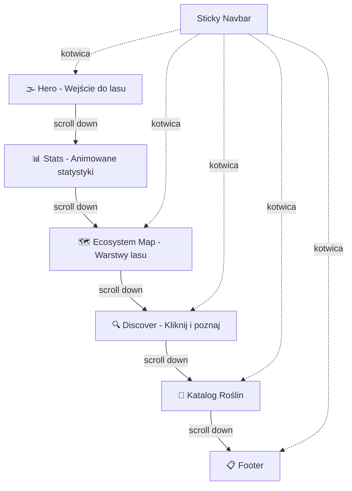

# 🌲 Leśny Herbarium — Dokumentacja Projektu

## Spis Treści

1. [Opis Projektu](#opis-projektu)
2. [Cel i Grupa Docelowa](#cel-i-grupa-docelowa)
3. [Stack Technologiczny](#stack-technologiczny)
4. [Struktura Plików](#struktura-plików)
5. [Architektura Strony](#architektura-strony)
6. [Sekcje Strony — Szczegółowe Opisy](#sekcje-strony)
7. [Nawigacja](#nawigacja)
8. [Efekty Wizualne i Techniczne](#efekty-wizualne-i-techniczne)
9. [Modale](#modale)
10. [Design System](#design-system)
11. [Responsywność](#responsywność)
12. [Accessibility](#accessibility)
13. [Performance](#performance)
14. [Struktura Danych](#struktura-danych)
15. [Zasoby i Źródła](#zasoby-i-źródła)
16. [Deploy i Hosting](#deploy-i-hosting)

---

## Opis Projektu

**Leśny Herbarium** to edukacyjna, jednostronicowa witryna internetowa prezentująca interaktywny katalog roślin leśnych oraz ekosystem lasu. Strona łączy **edukację przyrodniczą** z **nowoczesnym web designem**, oferując:

- **Interaktywny katalog roślin** z filtrami kategorii i wyszukiwarką
- **Mapę warstw ekosystemu leśnego** — klikalne warstwy od gleby po niebo
- **Sekcję ciekawostek** ("Kliknij i poznaj") z kategoriami i mini-modalami
- **Animowane statystyki** o polskich lasach
- **Efekt parallax** w sekcji Hero
- **Efekt forest particles** (pyłki/pyłki kwiatowe) podczas scrollowania

**Typ projektu:** Strona informacyjna / edukacyjna / katalog (one-page)
**Tematyka:** Rośliny, las, natura, ekosystem leśny
**Interaktywność:** Parallax, filtry, wyszukiwarka, modale, animacje scroll-triggered, canvas particles

---

## Cel i Grupa Docelowa

### Cele projektu
- Zaprezentowanie ekosystemu lasu i jego mieszkańców w interaktywnej formie
- Nauka frontendowych technologii (HTML/CSS/JS) poprzez praktyczny projekt
- Stworzenie efektownego elementu do portfolio webdevowego
- Edukacja przyrodnicza w przystępnej, wizualnej formie

### Grupa docelowa strony
- Uczniowie i studenci zainteresowani przyrodą
- Miłośnicy lasu i natury
- Osoby szukające edukacyjnych treści online
- Nauczyciele szukający materiałów dydaktycznych

### Grupa docelowa jako projekt portfolio
- Rekruterzy oceniający umiejętności frontendowe
- Inni developerzy szukający inspiracji

---

## Stack Technologiczny

| Technologia | Zastosowanie | Wersja |
|---|---|---|
| HTML5 | Struktura semantyczna, ARIA attributes | - |
| CSS3 | Stylowanie, animacje, parallax, zmienne CSS | - |
| Vanilla JavaScript | Interaktywność, filtry, wyszukiwarka, modale, canvas particles, localStorage | ES6+ (IIFE) |
| Google Fonts | Typografia (Playfair Display + Lato) | - |
| JSON | Dane roślin (plants.json) i ciekawostek (facts.json) | - |
| Canvas API | Efekt forest particles (pyłki podczas scrolla) | - |
| localStorage API | Section Memory — zapamiętywanie pozycji scrolla | - |

### Dlaczego zero frameworków?
- **Prostota** — brak konfiguracji, bundlerów, node_modules
- **Nauka fundamentów** — zrozumienie czystego HTML/CSS/JS
- **Wydajność** — brak narzutu frameworka (3 pliki: HTML, CSS, JS)
- **Hosting** — dowolny statyczny hosting (zero kosztów)

### Wymagania systemowe do developmentu
- Dowolny edytor kodu (VS Code rekomendowany)
- Przeglądarka (Chrome/Firefox z DevTools)
- Opcjonalnie: Live Server extension w VS Code

---

## Struktura Plików

```
lesny-herbarium/
│
├── index.html              # Główna i jedyna strona HTML (472 linie)
├── styles.css              # Wszystkie style CSS (~33 KB)
├── script.js               # Cała logika JavaScript (911 linii, IIFE)
├── README.md               # Dokumentacja projektu
│
├── data/
│   ├── plants.json         # Dane 15 gatunków roślin/grzybów
│   └── facts.json          # Ciekawostki o przyrodzie (6 kategorii)
│
├── .kilocode/              # Konfiguracja agenta AI
│   ├── rules/              # Reguły kodowania i workflow
│   └── workflows/          # Workflowy analityczne
│
├── plans/                  # Plany i dokumentacja projektowa
│   └── ...
│
└── .vscode/
    └── extensions.json     # Rekomendowane rozszerzenia VS Code
```

---

## Architektura Strony

### Diagram przepływu sekcji



### Architektura JavaScript (IIFE pattern)

```
script.js (IIFE)
├── loadPlantsData()          # Fetch plants.json
├── renderPlants()            # Renderowanie kart roślin
├── filterByCategory()        # Filtr katalogu po kategorii
├── filterBySearch()          # Wyszukiwarka w katalogu
├── applyFilters()            # Łączenie filtrów
├── openModal() / closeModal() # Modal szczegółów rośliny
├── initScrollProgress()      # Pasek postępu scrolla
├── initNavbarScroll()        # Zmiana navbar przy scrollu
├── initHamburger()           # Menu mobilne
├── initScrollToTop()         # Przycisk "wróć na górę"
├── initSmoothScroll()        # Smooth scroll do sekcji
├── initHeroParallax()        # Parallax Hero (4 warstwy)
├── initStatsCountUp()        # Animacja liczników statystyk
├── initEcosystemMap()        # Interaktywna mapa warstw
│   ├── openEcoLayerModal()
│   └── closeEcoLayerModal()
├── initDiscover()            # Sekcja ciekawostek
│   ├── loadFactsData()       # Fetch facts.json
│   ├── renderFacts()
│   ├── filterFactsByCategory()
│   ├── openFactModal()
│   └── closeFactModal()
├── initKeyboardNavigation()  # Nawigacja klawiaturą (↑↓)
├── initSectionMemory()       # localStorage - zapamiętywanie pozycji
├── initForestParticles()     # Canvas particles podczas scrolla
└── init()                    # Punkt wejścia — inicjalizacja
```

---

## Sekcje Strony

### Sekcja 1: 🌫️ Hero — Wejście do lasu

**ID:** `#hero`
**Elementy HTML:** `.hero`, `.hero-bg`, `.hero-overlay`, `.hero-content`, `.hero-foreground`, `.hero-scroll-indicator`

**Opis wizualny:**
Pełnoekranowa sekcja z wielowarstwowym efektem parallax. Tytuł "Leśny Herbarium" z podtytułem i przyciskiem CTA "Przeglądaj katalog".

**Treści:**
- Tytuł: **"Leśny Herbarium"**
- Podtytuł: **"Odkryj tajemnice ekosystemu leśnego — od gleby po korony drzew"**
- CTA: link do `#catalog`

**Efekty:**
- **Multi-layer parallax** (4 warstwy z `data-speed`): bg (0.3), overlay (0.5), content (0.15), foreground (0.6)
- Parallax wyłączony na mobile (`window.innerWidth < 768`)
- `requestAnimationFrame` dla wydajności (throttling)

---

### Sekcja 2: 📊 Stats — Animowane Statystyki

**ID:** `#stats`
**Elementy HTML:** `.stats-section`, `.stats-grid`, `.stat-item`

**Opis wizualny:**
Sekcja z 4 animowanymi licznikami statystyk o polskich lasach. Animacja uruchamia się gdy sekcja pojawi się w viewport.

**Statystyki:**
| Ikona | Wartość | Opis |
|---|---|---|
| 🌳 | 9 500 000 ha | Powierzchnia lasów w Polsce |
| 🌲 | 2 500 mld | Drzew rośnie w polskich lasach |
| 💨 | 60 mln ton | Tlenu produkują rocznie |
| 🦌 | 8 000+ | Gatunków zwierząt w lasach |

**Animacja:** Count-up effect (0 → wartość docelowa w 2000ms), jednorazowa (`hasAnimated` flag), `toLocaleString('pl-PL')`

---

### Sekcja 3: 🗺️ Ecosystem Map — Warstwy Lasu

**ID:** `#ecosystem-map`
**Elementy HTML:** `.ecosystem-map`, `.ecosystem-layer` (7 warstw), `.layer-tooltip`, `.eco-modal-overlay`

**Opis wizualny:**
Interaktywna mapa 7 warstw ekosystemu leśnego. Każda warstwa jest klikalna i otwiera modal ze szczegółowym opisem, ciekawostkami i przedstawicielami.

**Warstwy (od góry do dołu):**
| Warstwa | Emoji | Klucz |
|---|---|---|
| Niebo | ☁️ | `niebo` |
| Korona Drzew | 🌳 | `korona` |
| Pnie Drzew | 🪵 | `pnie` |
| Podszyt | 🌾 | `podszyt` |
| Runo Leśne | 🌿 | `runo` |
| Ściółka | 🍂 | `sciolka` |
| Gleba | 🪱 | `gleba` |

**Interakcje:**
- Kliknięcie/klawiatura (Enter/Space) na warstwie → otwarcie modala
- Modal zawiera: opis, 3 ciekawostki, lista przedstawicieli
- Zamykanie: przycisk X, kliknięcie poza modal, Escape
- Animowane SVG zwierząt w warstwie korony (🐿️, 🐦, 🕊️)

**Dane:** `ecoLayerData` obiekt w `script.js` (linie 307-385)

---

### Sekcja 4: 🔍 Discover — Kliknij i Poznaj

**ID:** `#discover`
**Elementy HTML:** `.discover-section`, `.discover-filter-btn`, `.discover-grid`, `.fact-modal-overlay`

**Opis wizualny:**
Sekcja z kartami ciekawostek o mieszkańcach lasu. Filtrowanie po kategoriach, kliknięcie karty otwiera mini-modal z obrazkiem i ciekawostką.

**Filtry kategorii:** Wszystkie, Drzewa, Kwiaty, Grzyby, Rośliny, Zwierzęta

**Dane:** Ładowane dynamicznie z `data/facts.json` via `fetch()`
**Skeleton loading:** Placeholderowe karty podczas ładowania

**Mini-modal ciekawostki:** Obrazek (z fallbackiem), nazwa + kategoria, treść ciekawostki

---

### Sekcja 5: 🌿 Katalog Roślin

**ID:** `#catalog`
**Elementy HTML:** `.catalog`, `.filter-btn`, `.search-input`, `.plants-grid`, `.modal-overlay`

**Opis wizualny:**
Główny interaktywny katalog 15 gatunków roślin/grzybów z filtrami kategorii, wyszukiwarką i modalem szczegółów.

**Filtry kategorii (6 przycisków):** Wszystkie, Drzewa, Krzewy, Kwiaty, Grzyby, Zioła

**Wyszukiwarka:** Wyszukiwanie po nazwie polskiej i łacińskiej, debounce 200ms, case-insensitive

**Karty roślin zawierają:** Obrazek (z emoji fallback `onerror`), nazwa polska, nazwa łacińska, badge kategorii

**Licznik wyników:** "Wyświetlane: X z Y" (aria-live="polite")

**Modal szczegółów rośliny:** Obrazek (emoji kategorii), kategoria, nazwa, nazwa łacińska, opis, 4 szczegóły (wysokość, kwitnienie, siedlisko, warstwa lasu), ciekawostka

**Dane:** Ładowane dynamicznie z `data/plants.json` via `fetch()` (15 gatunków)

---

### Sekcja 6: 📋 Footer

**ID:** `#footer`
**Elementy HTML:** `.footer`, `.footer-section` (4 kolumny)

**Zawartość:**
1. **Leśny Herbarium** — opis projektu
2. **Nawigacja** — linki do sekcji
3. **Źródła** — Lasy Państwowe, Flora Polski
4. **Projekt** — stack info + link GitHub

**Bottom:** `© 2026 Leśny Herbarium. Projekt edukacyjny.`

---

## Nawigacja

### Desktop
- **Sticky navbar** — przezroczysty w Hero, ciemne tło po scrollu > 50px
- Linki-kotwice do sekcji: Strona główna, Katalog roślin, Kontakt
- Logo z emoji 🌲 i tekstem "Leśny Herbarium"
- Smooth scroll z offsetem na wysokość navbara

### Mobile
- **Hamburger menu** (3 kreski → animacja X)
- Menu zamyka się po kliknięciu linku

### Dodatkowe mechanizmy nawigacji
| Mechanizm | Opis | Implementacja |
|---|---|---|
| **Scroll Progress Bar** | Pasek postępu scrolla na górze strony | `initScrollProgress()` |
| **Scroll to Top** | Przycisk pojawia się po 50% scrolla | `initScrollToTop()` |
| **Keyboard Navigation** | Arrow Up/Down do nawigacji między sekcjami | `initKeyboardNavigation()` |
| **Section Memory** | Zapamiętuje ostatnią sekcję w localStorage | `initSectionMemory()` |
| **Smooth Scroll** | Płynne przewijanie do kotwic | `initSmoothScroll()` |

---

## Efekty Wizualne i Techniczne

### Multi-layer Parallax (Hero)

**Metoda:** JavaScript `requestAnimationFrame` + `transform: translateY()`

**Warstwy:**
| Warstwa | Speed | Efekt |
|---|---|---|
| `.hero-bg` | 0.3 | Tło przesuwa się wolniej |
| `.hero-overlay` | 0.5 | Pół-overlay |
| `.hero-content` | 0.15 | Tekst prawie statyczny |
| `.hero-foreground` | 0.6 | Pierwszy plan przesuwa się szybciej |

**Optymalizacje:** Wyłączony na mobile, `requestAnimationFrame` + `ticking` flag, wyłącza się po scrollu poza Hero

### Forest Particles (Canvas)

Animowane cząsteczki (pyłki kwiatowe) pojawiające się podczas scrollowania. Canvas 2D overlay (`z-index: 50`, `pointer-events: none`). Max 60 cząsteczek, kolory złoty i zielony. Wyłączony na mobile.

### Stats Count-Up Animation

`requestAnimationFrame` + `data-target` atrybut, duration 2000ms, `toLocaleString('pl-PL')`, trigger scroll do 75% viewport, jednorazowa animacja.

### Scroll Progress Bar

Obliczenie procentu scrolla i ustawienie `width` na `.scroll-progress`

### Escape HTML Helper

Funkcja `escapeHtml()` zapobiega XSS przy renderowaniu danych z JSON.

### Image Loading States

- Pierwsze 4 karty: `loading="eager" fetchpriority="high"`
- Reszta: `loading="lazy" decoding="async"`
- Fallback: Emoji przy błędzie ładowania (`onerror`)

---

## Modale

Projekt zawiera **3 osobne modale**:

### 1. Modal Szczegółów Rośliny (`.modal-overlay`)
- **Trigger:** Kliknięcie karty w Katalogu Roślin
- **Zawartość:** Obrazek, kategoria, nazwa, nazwa łacińska, opis, 4 detale, ciekawostka
- **Zamykanie:** Przycisk X, kliknięcie poza modal, Escape

### 2. Modal Warstwy Ekosystemu (`.eco-modal-overlay`)
- **Trigger:** Kliknięcie warstwy w Ecosystem Map
- **Zawartość:** Emoji, tytuł, opis, lista ciekawostek, przedstawiciele
- **7 warstw:** niebo, korona, pnie, podszyt, runo, sciolka, gleba

### 3. Mini-Modal Ciekawostki (`.fact-modal-overlay`)
- **Trigger:** Kliknięcie karty w Discover
- **Zawartość:** Obrazek (opcjonalny), nazwa, kategoria, ciekawostka

---

## Design System

### Paleta Kolorów (CSS Custom Properties)

| Zmienna | Wartość | Użycie |
|---|---|---|
| `--forest-darkest` | #0d260d | Navbar |
| `--forest-dark` | #1a3c1a | Hero |
| `--forest-green` | #2d5a27 | Zieleń drzew |
| `--leaf-green` | #4a7c3f | Liście |
| `--moss-green` | #6b8f5e | Mech |
| `--soil-dark` | #3e2723 | Ciemna gleba |
| `--soil-brown` | #5d4037 | Brąz gleby |
| `--bark-brown` | #5c3d2e | Kora |
| `--sky-blue` | #87ceeb | Niebo |
| `--sun-gold` | #d4a843 | Słońce |
| `--text-on-dark` | #f0ead6 | Kremowy tekst |
| `--text-on-light` | #2c2c2c | Ciemny tekst |

### Typografia

| Font | Zastosowanie | Źródło |
|---|---|---|
| **Playfair Display** | Nagłówki (h1-h3) | Google Fonts |
| **Lato** (300, 400, 700) | Tekst body | Google Fonts |

---

## Responsywność

| Breakpoint | Zakres | Urządzenie |
|---|---|---|
| Mobile | 0 - 767px | Telefony |
| Tablet | 768 - 1023px | Tablety |
| Desktop | 1024px+ | Laptopy, monitory |

**Zmiany na mobile (< 768px):** Parallax wyłączony, Forest Particles wyłączony, hamburger menu, single-column layout, uproszczone animacje

---

## Accessibility

- **Semantyczny HTML** — `header`, `main`, `section`, `footer`, `nav`, `article`
- **ARIA attributes** — `role="button"`, `role="dialog"`, `aria-modal`, `aria-label`, `aria-expanded`, `aria-hidden`, `aria-live="polite"`
- **Keyboard navigation** — Enter/Space na kartach, Escape do zamykania modali
- **Focus management** — focus na przycisk zamykania po otwarciu modala
- **sr-only** — klasa dla ukrytych label
- **Loading states** — skeleton cards podczas ładowania danych
- **No results states** — komunikat gdy brak wyników filtrowania

---

## Performance

- **Vanilla JS** — zero bibliotek, zero zależności
- **IIFE pattern** — izolacja scope, brak zmiennych globalnych
- **Lazy loading obrazów** — `loading="lazy"` dla kart poza viewportem
- **Debounced search** — 200ms opóźnienie przy wyszukiwaniu
- **`requestAnimationFrame`** — parallax i count-up animacje
- **Canvas particles** — wyłączony na mobile, max 60 cząsteczek
- **LocalStorage debounced** — 300ms opóźnienie przy zapisywaniu pozycji
- **HTML escaping** — zabezpieczenie przed XSS

---

## Struktura Danych

### plants.json (15 gatunków)

```json
{
  "id": 1,
  "name": "Dąb szypułkowy",
  "latinName": "Quercus robur",
  "category": "drzewa",
  "layer": "korona",
  "description": "Opis gatunku...",
  "funFact": "Ciekawostka...",
  "image": "https://...",
  "height": "25-40 m",
  "flowering": "kwiecień-maj",
  "habitat": "Lasy mieszane, żyzne siedliska"
}
```

**Kategorie:** drzewa (3), krzewy (3), kwiaty (3), grzyby (3), zioła (2) — łącznie: 15

### facts.json

```json
{
  "name": "Nazwa",
  "category": "drzewa | kwiaty | grzyby | rośliny | zwierzęta",
  "emoji": "🌳",
  "image": "https://...",
  "funFact": "Treść ciekawostki..."
}
```

---

## Zasoby i Źródła

### Zdjęcia
- Obrazy ładowane z zewnętrznych URL (Unsplash, Wikimedia, inne źródła)
- Fallback na emoji przy błędzie ładowania

### Źródła treści edukacyjnych
- Lasy Państwowe (lasy.gov.pl)
- Wikipedia — informacje o gatunkach

### Narzędzia
- **VS Code** + Live Server extension
- **Chrome DevTools** — debugging, responsive testing
- **Kilo Code AI** — asystent kodowania

---

## Deploy i Hosting

### GitHub Pages (rekomendowane)
1. Utworzyć repozytorium na GitHub
2. Push kodu
3. Settings → Pages → Source: main branch, / (root)

### Netlify (alternatywa)
1. Konto na netlify.com
2. Drag & drop folderu projektu

**Koszt:** 0 zł (oba rozwiązania darmowe dla statycznych stron)