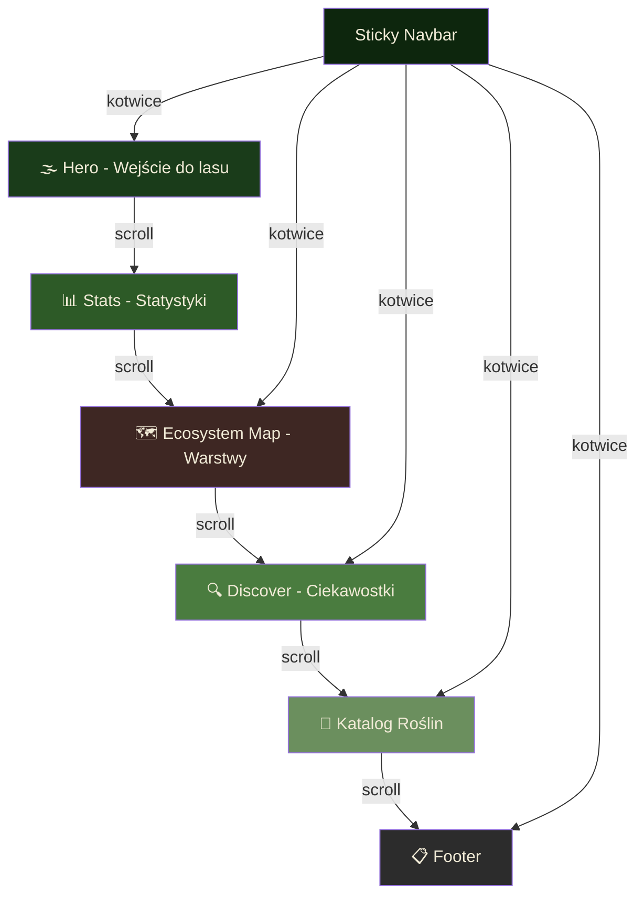
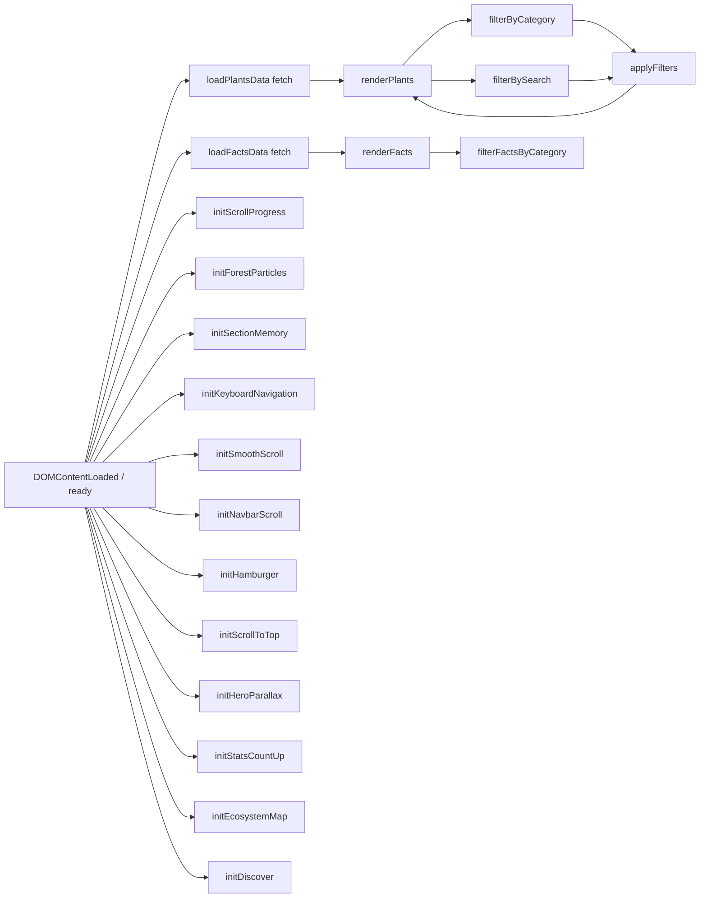

# 🌲 Leśny Herbarium — Plan Implementacji

## Opis Projektu

**Leśny Herbarium** to jednostronicowa witryna edukacyjna prezentująca interaktywny katalog roślin leśnych, mapę warstw ekosystemu i sekcję ciekawostek. Strona oferuje filtry, wyszukiwarkę, 3 modale, animacje i efekty wizualne.

**Stack:** Vanilla HTML + CSS + JavaScript (zero frameworków, zero zależności)
**Hosting:** GitHub Pages lub Netlify (darmowy)
**Budżet:** 0 zł

---

## Struktura Plików

```
lesny-herbarium/
├── index.html          # Główna strona (472 linie)
├── styles.css          # Wszystkie style (~33 KB)
├── script.js           # Logika JS (911 linii, IIFE)
├── data/
│   ├── plants.json     # 15 gatunków roślin/grzybów
│   └── facts.json      # Ciekawostki (6 kategorii)
└── README.md           # Dokumentacja projektu
```

---

## Sekcje Strony (od góry do dołu)

### 0. 🌫️ Hero — Wejście do lasu
- Pełnoekranowa sekcja z multi-layer parallax (4 warstwy)
- Tytuł: "Leśny Herbarium" z podtytułem
- CTA: "Przeglądaj katalog" → scroll do #catalog
- Parallax: `requestAnimationFrame` + `data-speed` (0.15–0.6)
- Wyłączony na mobile (< 768px)

### 1. 📊 Stats — Animowane Statystyki
- 4 liczniki z animacją count-up (0 → wartość w 2000ms)
- Dane: 9 500 000 ha lasów, 2 500 mld drzew, 60 mln ton tlenu, 8 000+ gatunków
- Trigger: scroll do 75% viewport (jednorazowa animacja)
- Formatowanie: `toLocaleString('pl-PL')`

### 2. 🗺️ Ecosystem Map — Warstwy Lasu
- 7 interaktywnych warstw: Niebo, Korona, Pnie, Podszyt, Runo, Ściółka, Gleba
- Kliknięcie warstwy → modal z opisem, 3 ciekawostkami, przedstawicielami
- Animowane SVG zwierząt w warstwie korony (🐿️🐦🕊️)
- Dane: `ecoLayerData` obiekt w script.js

### 3. 🔍 Discover — Kliknij i Poznaj
- Karty ciekawostek o mieszkańcach lasu
- Filtry: Wszystkie, Drzewa, Kwiaty, Grzyby, Rośliny, Zwierzęta
- Kliknięcie karty → mini-modal (obrazek, nazwa, ciekawostka)
- Dane: ładowane z `data/facts.json` via fetch()

### 4. 🌿 Katalog Roślin
- 15 gatunków z danymi: nazwa, łacińska, opis, wysokość, kwitnienie, siedlisko, warstwa
- Filtry: Wszystkie, Drzewa, Krzewy, Kwiaty, Grzyby, Zioła
- Wyszukiwarka: nazwa + łacińska, debounce 200ms
- Licznik wyników: "Wyświetlane: X z Y"
- Kliknięcie karty → modal szczegółów
- Dane: ładowane z `data/plants.json` via fetch()

### 5. 📋 Footer
- 4 kolumny: opis, nawigacja, źródła, projekt + GitHub
- `© 2026 Leśny Herbarium. Projekt edukacyjny.`

---

## Nawigacja

- **Sticky navbar** z przezroczystym tłem (zmienia się na ciemne po scrollu > 50px)
- Linki-kotwice z **smooth scrolling** (offset na wysokość navbara)
- Na mobile: hamburger menu
- **Scroll Progress Bar** — pasek postępu na górze strony
- **Scroll to Top** — przycisk po 50% scrolla
- **Keyboard Navigation** — Arrow Up/Down między sekcjami
- **Section Memory** — localStorage zapamiętuje ostatnią sekcję

---

## Efekty Techniczne

### Multi-layer Parallax
- 4 warstwy z różnymi prędkościami (0.15–0.6)
- `requestAnimationFrame` + `ticking` flag (throttling)
- Wyłączony na mobile

### Forest Particles (Canvas)
- Cząsteczki (pyłki kwiatowe) pojawiające się podczas scrollowania
- Max 60 cząsteczek, kolory złoty i zielony
- Canvas overlay z `pointer-events: none`
- Wyłączony na mobile

### Scroll-Triggered Animations
- Stats count-up: scroll do 75% viewport (jednorazowa)
- Skeleton loading dla kart podczas fetch()
- Fade-in kart z `animation-delay` (index * 0.05s)

### Image Loading
- Pierwsze 4 karty: `loading="eager" fetchpriority="high"`
- Reszta: `loading="lazy" decoding="async"`
- Fallback: emoji przy błędzie (`onerror`)

### Security
- `escapeHtml()` helper — ochrona przed XSS
- Dane z JSON escapowane przed wstawieniem do DOM

### Responsywność
- Breakpoint: 768px (mobile/desktop)
- Na mobile: parallax wyłączony, particles wyłączone, hamburger menu, single-column

---

## Paleta Kolorów

```
--forest-darkest:   #0d260d    /* Navbar */
--forest-dark:      #1a3c1a    /* Hero */
--forest-green:     #2d5a27    /* Zieleń drzew */
--leaf-green:       #4a7c3f    /* Liście */
--moss-green:       #6b8f5e    /* Mech */
--soil-dark:        #3e2723    /* Ciemna gleba */
--soil-brown:       #5d4037    /* Brąz gleby */
--bark-brown:       #5c3d2e    /* Kora */
--sky-blue:         #87ceeb    /* Niebo */
--sun-gold:         #d4a843    /* Słońce */
--text-on-dark:     #f0ead6    /* Kremowy tekst */
--text-on-light:    #2c2c2c    /* Ciemny tekst */
```

---

## Typografia

- **Heading font:** Google Fonts — "Playfair Display" (400, 600, 700)
- **Body font:** Google Fonts — "Lato" (300, 400, 700)

---

## Źródła Zasobów (Darmowe)

| Zasób | Źródło |
|---|---|
| Zdjęcia | Unsplash, Wikimedia, zewnętrzne URL |
| Ikony emoji | Unicode (wbudowane) |
| Fonty | Google Fonts (bezpłatne) |

---

## Diagram Architektury Strony



---

## Diagram Techniczny — Przepływ JS



---

## Modale

### 1. Plant Detail Modal
- Trigger: kliknięcie karty w Katalogu
- Zawartość: obrazek, kategoria, nazwa, łacińska, opis, 4 detale, funFact
- Zamykanie: X, click-outside, Escape

### 2. Eco Layer Modal
- Trigger: kliknięcie warstwy w Ecosystem Map
- Zawartość: emoji, tytuł, opis, 3 ciekawostki, przedstawiciele
- 7 warstw: niebo, korona, pnie, podszyt, runo, sciolka, gleba

### 3. Fact Mini-Modal
- Trigger: kliknięcie karty w Discover
- Zawartość: obrazek, nazwa, kategoria, funFact

---

## Kolejność Implementacji (Plan Zadań)

1. **Szkielet HTML** — Semantyczna struktura z 6 sekcjami (header, main, footer)
2. **Base CSS** — Zmienne CSS, typografia, paleta kolorów, reset
3. **Layout sekcji** — Stylowanie każdej sekcji (Hero, Stats, Ecosystem Map, Discover, Katalog, Footer)
4. **Nawigacja** — Sticky navbar, smooth scroll, hamburger menu
5. **Katalog Roślin** — Renderowanie kart, filtry, wyszukiwarka, modal
6. **Ecosystem Map** — Interaktywne warstwy, modal z ciekawostkami
7. **Discover** — Karty ciekawostek, filtry, mini-modal
8. **Stats** — Count-up animation, scroll trigger
9. **Efekty wizualne** — Multi-layer parallax, forest particles, scroll progress
10. **UX enhancements** — Scroll-to-top, keyboard nav, localStorage memory
11. **Dane** — plants.json + facts.json z pełnymi danymi
12. **Polishing** — Skeleton loading, no-results, image fallbacks, escapeHtml
13. **Accessibility** — ARIA labels, focus management, keyboard nav
14. **Responsywność** — Mobile breakpoints, hamburger, wyłączony parallax/particles
15. **Deploy** — GitHub Pages lub Netlify

---

## Uwagi Końcowe

- **Brak frameworków** — czyste HTML/CSS/JS, idealne do nauki
- **IIFE pattern** — izolacja scope, brak zmiennych globalnych
- **Progressive Enhancement** — strona działa bez JS (statyczny HTML)
- **Performance** — lazy loading, eager loading dla hero, requestAnimationFrame, canvas particles
- **Accessibility** — semantyczny HTML, ARIA, focus management, keyboard nav
- **Security** — escapeHtml helper (ochrona XSS)